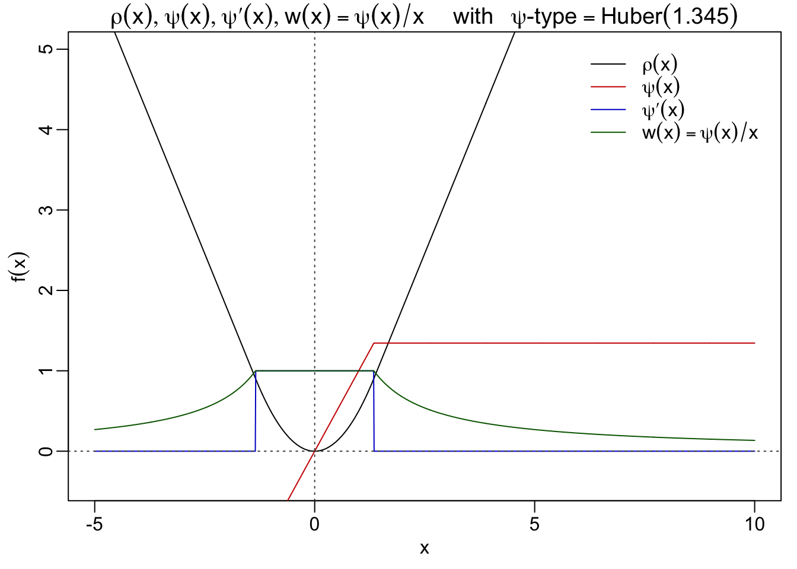
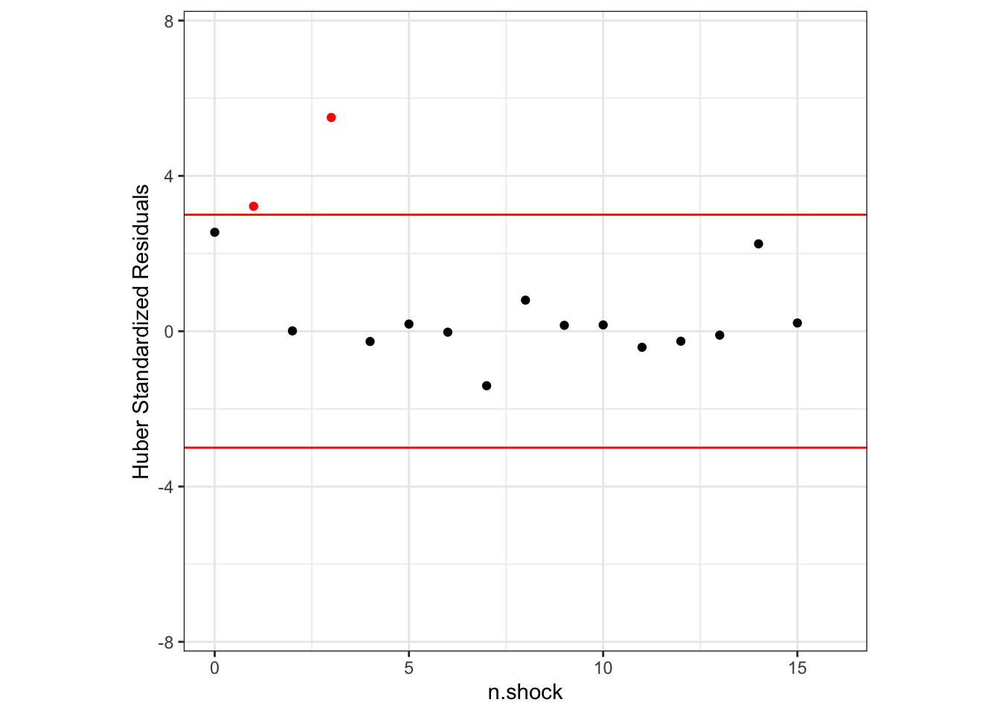
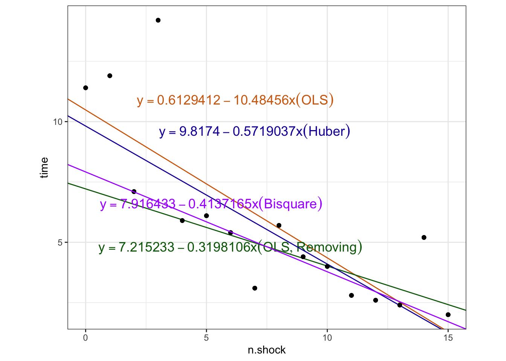
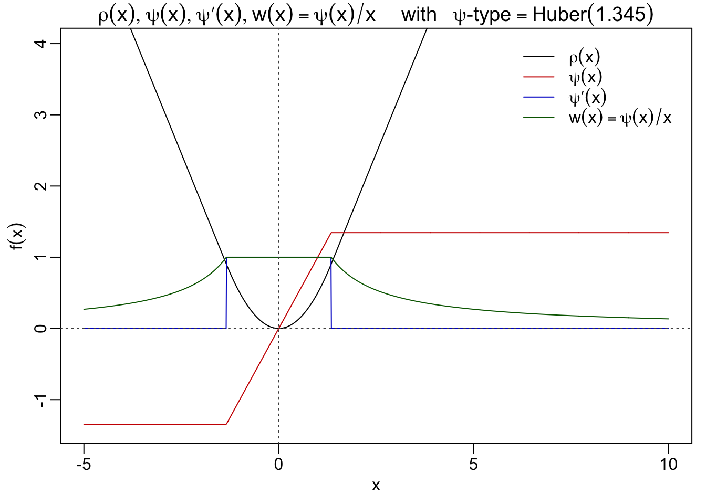

# Preface{-}


This summer I am so lucky and privileged to be able to be mentored by [Professor Gagnon](https://philippegagnonphd.github.io/website "Professor Gagno") to study in the fields of Robust Statistics and Actuarial Science. Since personally I owed a lot to numerous excellent documents from all of these respectable scholars, who basically could not only give strict `Mathematical Proofs` but also supply with embedded `Reproducable Experiments`^[I am sorry that some code are temporarily hided for aesthetic reasons, but I am trying to learn how to design a button to let readers decide to hide or expand.], one of the core spirits that the ***R Markdown*** have been promoting all the time. I came to realize that I could share, if any, experiences learnt from such outstanding researchers and their documents, it could hopefully transform into my giving back to the whole statistics communities and actuarial science societies. For now, although some energy were devoted to learn how to set up and publish a short e-book, I am still quite an inexperienced user in web-related programming. Hoping to be able to facilitate my dear peers, and all of the extraoridanary researchers heading for the same better future, let's start our journey~


# Introduction {#intro}

In this document, we aim to understand the robust regression methods. In particular, we aim to understand what is the problem within the classical normal linear regression and why robust models perform better in the presence of outliers. To facilitate our understanding, we will be using the example of linear regression, along with the data set ***shock***, which can be found within the R package ***RobStatTM***.

The data set used in the passage corresponds to an experiment on the speed of learning of rats. Times were recorded for a rat to go through a shuttlebox in successive attempts. If the time exceeded 5 seconds, the rat received an electric shock for the duration of the next attempt. The data are the number of shocks received and the average time for all attempts between shocks. We are trying to summarize the data tendency and use the n.shocks to predict the time. The whole document will apply functions in the R package ***ggplot2*** and related packages like ***ggthemes*** to achieve better visualization.


```r
library(RobStatTM)
data(shock)
library(ggplot2)
library(ggthemes)
```


# Classical Linear Regression{#Classical-Linear-Regression}

In statistics, we aim to find pattern within data sets through fitting relevant models. A particular model that has proved to be useful is linear regression. In this section, we begin by describing this model in generalities and then proceed to explain how it can be estimated. This explanation of the general model will turn out to be useful to characterize robust and non-robust models.

## General Model{#General-Model}

Consider that we are given a data set of the form $(\mathbf{x}_i, y_i)_{i = 1}^n$ where $\mathbf{x}_1 := (x_{11}, \ldots, x_{1p})^T, \ldots, \mathbf{x}_n := (x_{n1}, \ldots, x_{np})^T \in \mathbb{R}^p$ are $n$ vectors with data points from $p$ covariates and $y_1, \ldots, y_n\in\mathbb{R}$ are $n$ observations of a dependent random variable, with $n$ and $p$ being positive integers such that $n > p$. In this document, we consider that $\mathbf{x}_1, \ldots, \mathbf{x}_n$ are known vectors, not realizations of random variables, contrarily to $y_1, \ldots, y_n.$

We consider that $x_{11} = \ldots = x_{n1} = 1$ to add an intercept to the model. In linear regression, we want to use the covariates to model the dependent variable and we assume that:


\begin{equation}
y_i = \mathbf{x}_i^T \boldsymbol\beta + \epsilon_i,  (\#eq:model)
\end{equation}


where $\boldsymbol\beta := (\beta_1, \ldots, \beta_p)^T$ is the vector of regression coefficients, and $\epsilon_1, \ldots, \epsilon_n$ are $n$ random errors that allow to explain the discrepancies between $y_i$ and $\mathbf{x}_i^T \boldsymbol\beta$.

While not especially important in itself, the idea below will play an important auxiliary role in the development of estimates for regression. Considering that the random error term $\epsilon_i$ satisfying the ***Mutiplicative Model***:

\begin{equation}
\epsilon_i=\sigma\mathcal{u_i} \quad i=1,2,\ldots,n,  (\#eq:scale)
\end{equation} where the ${u}_i$ 's are independent and identically distributed (IID) with density $f$ and $\sigma$ \> 0 is the unknown scale parameter. After simple steps of transforming random variables, the distributions of the $\epsilon_i$ 's density will be \begin{equation}
\frac{1}{\sigma} f(\frac{\epsilon_i} {\sigma}),\,\sigma >0.
(\#eq:eps)
\end{equation}

We can condense the model \@ref(eq:model) by writing it in the matrix version as follows:

```{=tex}
\begin{equation}
\textbf{y} = \mathbf{X}\boldsymbol{\beta} + \boldsymbol\epsilon, (\#eq:matrix-model)
\end{equation}
```
where $\mathbf{y}$ := $(y_1, \ldots, y_n)^T$, $\mathbf{X}$ is a $n$ $\times$ $p$ matrix with lines given by $\mathbf{x}_1^T, \ldots, \mathbf{x}_n^T$, and $\boldsymbol\epsilon$ := $(\epsilon_1, \ldots, \epsilon_n)^T$. [^1]

[^1]: We use the notation $a := b$ to say that we define $a$ by setting it equal to $b$.

## Classical Assumptions about Random Errors

In the [last section](#Classical-Linear-Regression), we introduced the model in generalities. In statistics, the most widespread assumption we make about the distribution of the random errors $\epsilon_i$s in the model introduced is, no doubt, that they are IID normal, with $\epsilon_i \overset{\mathrm{iid}}{\sim} \mathcal{N(0,\sigma^2)}$. It could be translated into the matrix version as follows:

-   $E(\epsilon|\mathbf{X})=0$\
    $\quad$ Expected value of the error term is zero conditional on all values of the explanatory variable $\mathbf{x}_i$.
-   $Var(\epsilon|\mathbf{X})=\sigma^2$\
    $\quad$ The error term has the same variance conditional on all values of the explanatory variable, namely Homoskedasticity.
-   $\epsilon∼\mathcal{N}(0,\sigma^2)$\
    $\quad$ The error term is independent of the explanatory variables and normally distributed, namely Normality.

Note that when we assume the disturbance term $\epsilon_i$s follow the identical normal distribution, we still use the same letter $\sigma$ to denote the root of the true identical variance. Actually, it is because we could paraphrase the assumptions about the error term $\epsilon_i$s into the properties of random variable $u_i$s as this:

-   $u_i \overset{\mathrm{iid}}{\sim} \mathcal{N(0,1)}$\
    $\quad$ $u_i$'s are independent and identically distributed random variables, which follow the standard normal distribution.

In the following section, we will walk through the implications of these assumptions in two main methods, Maximum Likelihood Estimation and Ordinary Least Squares.

## Maximum Likelihood Estimation

A way to perform model fitting is to find the combination of parameter values which most likely explains the data observed. The maximum likelihood estimator is based on this idea: it is the combination of parameter values which maximize the likelihood function. The likelihood function serves as a measure of goodness of fit of a combination of parameter values, with respect to a given data set and model. In the wake of it, we will discuss how to obtain the likelihood function under the framework described in the last section.

The likelihood function $\mathcal{L}$ is a function which takes in the parameters $\boldsymbol{\beta}$ and $\sigma$ as inputs and outputs the likelihood of observing $\textbf{y}$ given $\beta$ and $\sigma$. From (1), we see that, given $\boldsymbol\beta$ and $\sigma$, $y_i$ follows from a transformation of $\epsilon_i$ after adding a location parameter of $\mathbf{x}_i^T \boldsymbol\beta$ (recall that the vectors $\mathbf{x}_i$ are considered known). Hence, the density of $y_i$ evaluated at $y_i$ is equal to

```{=tex}
\begin{equation}
\frac{1}{\sigma} f\left(\frac{y_i - \mathbf{x}_i^T \boldsymbol\beta}{\sigma}\right).
(\#eq:y-pdf)
\end{equation}
```
In addition, since we assumed in our model that the errors $\epsilon_i$ are independent, $y_i$ are also independent as translating independent variables by a constant term yields independent variables. Therefore, given $\boldsymbol{\beta}$ and $\sigma$, the likelihood of observing $\textbf{y}$ is the multiplication of the likelihood of observing each $y_i$ \@ref(eq:y-pdf).

The likelihood function evaluated at $\beta$ and $\sigma$ is thus given by

```{=tex}
\begin{equation}
\mathcal{L}(\boldsymbol{\beta},\sigma|\mathbf{y}):=\prod_{i=1}^{n}\frac{1}{\sigma}f( \frac{ y_i - \mathbf {x}^T_i \boldsymbol{\beta} } {\sigma})\,. (\#eq:L)
\end{equation}
```
Working directly with multiplication when maximizing can be quite challenging as it is hard to take derivative of multiplication over multiple variables to find the critical points (it is at the critical points that minimum and maximum values are achieved). In addition, the product of large amount of small density values can impair the precision of our calculation when using computers. To circumvent these difficulties, we usually take the $\log$ of the likelihood function. By taking the $\log$ of the likelihood function, we are able to transform maximizing multiplication to maximizing summation, which is much easier to work with. We define the log-likelihood function $\ell$ as

```{=tex}
\begin{equation}
\ell(\boldsymbol{\beta},\sigma|\mathbf{y}):=log\,\mathcal{L}(\boldsymbol{\beta},\sigma|\mathbf{y}) = -\sum_{i=1}^n\left(log\,\sigma+\rho\left(\frac{ y_i - \mathbf {x}^T_i \boldsymbol{\beta} } {\sigma}\right)\right)  (\#eq:logL)
\end{equation}
```
where $${\rho} := - log\,f.$$ As $\log$ is a strictly increasing function, the value which maximizes the original likelihood function is conveniently the same as the one that maximizes the log-likelihood. Therefore, using the log-likelihood when performing maximum likelihood estimation is preferred.

Under the normal assumption for the random errors $\epsilon_i, \; i=1,2,\ldots,n$, it is assumed that $f = \mathcal{N}(0, 1)$. Hence, the likelihood function $\mathcal{L}$ in the normal linear regression model becomes 
\begin{equation} 
\mathcal{L}(\boldsymbol\beta, \sigma \mid \mathbf{y}) = \prod_{i=1}^n \frac{1}{\sigma} \frac{1}{\sqrt{2\pi}}exp \Big\{{-\frac{(y_i - \mathbf {x}^T_i \boldsymbol{\beta})^2}{2\sigma^2}}\Big\}
 =\left(\frac{1}{\sigma\sqrt{2\pi}}\right)^n exp\Big\{{-\frac{\sum_{i=1}^{n} (y_i - \mathbf {x}^T_i \boldsymbol{\beta})^2}{2\sigma^2}}\Big\},
 (\#eq:L-normal)
\end{equation}

and the log-likelihood function $\ell$ in the \@ref(eq:logL) becomes 
\begin{equation}  
    \ell(\boldsymbol\beta, \sigma \mid \mathbf{y}) = -n\log\left(\sigma\sqrt{2\pi}\right) - \sum_{i=1}^{n} \frac{(y_i - \mathbf {x}^T_i \boldsymbol{\beta})^2}{2\sigma^2}.
(\#eq:logL-normal)
\end{equation}

As discussed above, maximizing likelihood function $\mathcal{L}$ is equivalent to maximizing the log-likelihood function $\ell$. Therefore, we only need to maximize $\texttt{(3)}$, which is equivalent to minimize 
\begin{equation} 
    n\log\sigma+\sum_{i=1}^{n}
    \frac{(y_i - \mathbf {x}^T_i \boldsymbol{\beta})^2}{2\sigma^2}.(\#eq:object1)
\end{equation}

So the parameter estimates should actually be write as the solution to the optimization question


\begin{equation}  
\hat{\boldsymbol{\beta}}_{MLE},\,\hat{\sigma}_{MLE}:=\, \argmax_{{\boldsymbol{\beta}},\,{\sigma}}\,n\log\sigma+\sum_{i=1}^{n}\frac{(y_i - \mathbf{x}^T_i \boldsymbol{\beta})^2}{2\sigma^2}
(\#eq:mle-def)
\end{equation}

A convenient property of normal linear regression is that we can easily calculate the exact value of the estimates under the classical and some specific assumptions. In this document, we assume that the $(\mathbf{X}\mathbf{X}^T)$ matrix is invertible, which could guarantee obtaining the $\beta$ estimate.

We give the results without proof in the following part. (Process: firstly, view $\sigma$ as a constant, then take partial derivative respect to $\beta$ and let the expression to 0 to get $\sigma$. Again, take partial derivative respect to $\hat{\sigma}_{MLE}$ and let the expression to 0 to obtain $\hat{\beta}_{MLE}$). The minimum of \@ref(eq:object1) is attained when

\begin{align} 
\hat{\boldsymbol\beta}_{MLE} &= (\mathbf{X}\mathbf{X}^T)^{-1}\mathbf{X}^T\mathbf{y}, \\\ \hat{\sigma}_{MLE}&=\sqrt{\frac{\sum_{i=1}^{n}(y_i - \textbf{x}_i^T\hat{\boldsymbol\beta}_{MLE})^2}{n}}.
(\#eq:mle)
\end{align}

But the $\hat{\sigma}_{MLE}$ is arguably biased for estimating the true $\sigma$.

## Ordinary Least Squares Estimation

Another commonly used estimate for $\beta$ is the Ordinary Least Squares $OLS$) estimate. Recall that the criteria we use for obtaining $OLS$ estimates is to find the estimator $\hat{\beta}_{OLS}$ that minimizes the Sum of Squared Residuals $SSR$. $SSR$ could be defined in scalar notation as 

\begin{equation} 
\mathtt{SSR}:=\sum_{i=1}^nr_i^2\,
(\#eq:ssr)
\end{equation}

where the residual $r_i$ is given by $r_i:=y_i - \mathbf{x}^T_i \boldsymbol{\beta}.$ The vector of residuals $\mathbf{e}$ is given by $\mathbf{e} := (r_{1}, \ldots, r_{n})^T.$[^2] Hence, the vector $\mathbf{e}$ could also be computed by: $\mathbf{e} = \mathbf{y} - \mathbf{X}\boldsymbol{\hat{\beta}}.$ The corresponding matrix-form expansion of the Sum of Squared Residuals \@ref(eq:ssr) could be conducted as follows:

[^2]: Be careful about disguishing between random errors($\epsilon_i$) that cannot be observed and residuals ($r_i$) that can be observed.


\begin{align}
\mathtt{SSR} 
&:=\mathbf{e}^T\mathbf{e} \\
&= \mathbf{y}^T\mathbf{y} − {\hat{\boldsymbol\beta}^T}\mathbf{X}^T\mathbf{y} − \mathbf{y}^T\mathbf{X}{\hat{\boldsymbol\beta}} + \hat{\boldsymbol\beta}^T\mathbf{X}^T\mathbf{X}{\hat{\boldsymbol\beta}}\\
&= \mathbf{y}^T\mathbf{y} − 2{\hat{\boldsymbol\beta}^T}\mathbf{X}^T\mathbf{y} + {\hat{\boldsymbol\beta}^T}\mathbf{X}^T\mathbf{X}{\hat{\boldsymbol\beta}}
(\#eq:ssrm)
\end{align}


Take derivative of \@ref(eq:ssrm) with respect to $\boldsymbol{\hat\beta}$ and then let the equation be zero:


\begin{equation}
\frac{\partial \mathbf{e}^T\mathbf{e}}{\partial {\hat{\boldsymbol\beta}}} = −2\mathbf{X}^T\mathbf{y} +2\mathbf{X}^T\mathbf{X}{\hat{\boldsymbol\beta}} = \mathbf{0}.
(\#eq:ssr-matrix)
\end{equation}


As long as the inverse of $(\mathbf{X}^T\mathbf{X})$ exists, we could compute the estimate$\hat{\beta}_{OLS}$ without truly applying a lot of[^3] the assumptions: 

\begin{equation}
\hat{\boldsymbol\beta}_{OLS} = (\mathbf{X}\mathbf{X}^T)^{-1}\mathbf{X}^T\boldsymbol{\mathcal{y}},
(\#eq:beta-ols)
\end{equation}

[^3]: Actually, what we only assume so far is about the Linearity: the model is linear in the parameters

which is the same with $\hat{\boldsymbol{\beta}}_{MLE}$ showed in \@ref(eq:mle). In addition, since we know that $\hat{\sigma}_{MLE}$ is biased, we give the unbiased estimate for ${\sigma}$ by

\begin{equation}
\hat\sigma_{OLS}:=\sqrt{\frac{\sum_{i=1}^{n}(y_i-\boldsymbol{x_i}^T\boldsymbol{\hat{\beta}}_{OLS})^2}{n-p}}.
(\#eq:sigma-ols)
\end{equation}

## Experiments using Classical Linear Regression Methods{#Experi}

However, it is well known that the OLS estimate is extremely sensitive to the outliers. A single outlier can have large effect on the OLS estimate. Let's start to demonstrate how outliers could distort the fitted line.


Despite indicating the downward trend, the fit in the figure shown is nevertheless inaccurate. It hovers between the higher valued data from the top left corner and bottom right and the rest of the data without accurately fitting either groups. This is clearly not a good fit for the data set.

To standardize the residuals and conduct outliers detection, we let n equal 16 and p equal to 2 in the \@ref(eq:sigma-ols) to calculate the unbiased $\hat{\sigma}_{OLS}$.


In such a situation, no outliers would be deemed suspicious under the ***the three-sigma rule***, which refers to a thumb of rule in emprical science:  a traditional measure of the “outlyingness” of an observation xi with respect to a sample is the ratio between its distance to the sample mean and the sample standard deviation (SD) :
  $$t_i  = \frac{x_i-\bar{x}}{SD}.$$
Observations with $|t_i | > 3$ are traditionally deemed as suspicious (the “three-sigma rule”), based on the fact that they would be “very unlikely” under normality, since $P(|x| ≥ 3) = 0.003$ for a random variable x with a standard normal distribution. 

In this the residuals plot, there are no suspicious data entries as none of them have standardized residual of absolute value larger than 3. However, this is very misleading given what we observed in the fitted line. We might be able to say that Ordinary Least Squares estimates behave badly here. One remedy is to remove influential observations from the least-squares fit. Hence, we fit another linear model using OLS method to the shock data without 3 problematic data points. Apparently, this updated model is a much more accurate fit for the majority of the data entries.


Similarly, we compute the unbiased estimate for $\hat\sigma_{OLS}$ and then update the column for standardized residuals column in the shock.update dataset. 

However, when the model is updated by removing the observed outliers, standardized residuals of the data points with entry equal to 0,1,3 significantly increased, rendering value 3.81,4.56, and 7.24 respectively, confirming our suspicion that these entries are outliers.


Table: (\#tab:unnamed-chunk-9)Significantly Increasement in Standardized Residuals after Removing the 3 Suspicious Points

| n.shocks| time| updated.residuals| ols.standardized.updated.residuals|class   |
|--------:|----:|-----------------:|----------------------------------:|:-------|
|        3| 14.2|          7.944199|                           7.248111|outlier |
|        1| 11.9|          5.004578|                           4.566066|outlier |
|        0| 11.4|          4.184767|                           3.818089|outlier |

Also, we plot the OLS standardized residuals computed excluding the points with n.shocks equal to 0,1 and 3. From the updated plot, it is very clear that data entries with n.shocks equal to 0, 1, and 3 are indeed outliers.


```r
#plot updated standardized residuals
r2<-ggplot(data = bulk)+
  geom_point(aes(bulk$n.shocks, bulk$ols.standardized.updated.residuals))+
  geom_hline(yintercept = 3,color="red")+
  geom_hline(yintercept = -3,color="red")+
  xlab("n.shock")+
  ylim(-7.5,7.5)+
  ylab("Updated Standardized OLS residuals")+
  theme_bw()
r2<-r2+geom_point(data = outlier,aes(outlier$n.shocks, outlier$ols.standardized.updated.residuals),color="red")
r2
```


The lack of indication that these outliers are indeed outliers in our original fit is the result of ***Masking Effect***. In the original OLS fit, data entry with n.shocks equal to 3 deviates the most from the fit. In order to minimize the sum of square of residuals, the regression line is "pulled" toward the outliers and $\hat{\sigma}$ increases, both effects aids to mask the existence of outliers.

Take data entry with n.shocks equal to 3 as an example, in the original OLS model, it has a residual of 5.55; for the updated fit, the same data entry has a residual of 7.94. The standardized residuals of this data entry are 2.46 and 7.24 respectively. This large discrepancy is observed because the original fit largely adjust itself for the value of the outliers in the fitting process.


```
##   n.shocks time residuals standardized.residuals         type
## 4        3 14.2  5.554265               2.460839 original OLS
## 1        3 14.2  7.944199               7.248111  updated OLS
```

    Small Questions
    In most cases, we begin by running an OLS regression and doing some diagnostics. We will begin by running an OLS regression and looking at diagnostic plots examining residuals, fitted values, Cook’s distance, and leverage.

    Actually, it seems still a little wierd for me to directly say that the points with entry equal to 0, 1, 3 are problematic at the beginning. Because what we get will be different from that if using some classical techniques to detect the outliers.
    plot(ols,las=1)
    shock[c(8,15,4),]

# Classical Robust Regression: introduction to the M-estimation

## Motivation

The lack of robustness in OLS estimate is a consequence of the assumption we have made about the distribution of the random errors being normal. This translate into a minimization of the sum of the squared residuals; the model thus penalizes large residuals heavily, hence making the influence of outliers significant which leads to an inaccurate fit.

From another point of veiw, although removing 3 problematic data points, as one of the existed methods adopted by statistical analysts, leads to a greater performance result, the required subjective decisions also might pose a number of questions. Although the above example suggests a simple way, to detect and remove the outliers by the user, not everyone could recognize the suspicious points from the very beginning. Including such a query, questions could also be asked as follows:

-   Which point, on earth, should be removed?
-   When is an observation outlying enough to be deleted?
-   What if deleting a non-outlier results in underestimating the data variability?
-   How about the reliability of determining the statistical behavior of the complete procedure based on the user's subjective decisions?

Preferably, our ideal model should be able to "detect" the outliers and reduce their influences in the fitting process automatically. The latter is even preferable to excluding outliers. Indeed, in some situations, it is not as clear as with points with n.shocks equal to 0,1, and 3 whether certain points are outliers or not. In our example, other points (e.g., the point with n.shocks equal to 7) are suspicious but it is not clear whether they are outliers or not. This renders motivation for robust models: model that are less susceptible to outliers' influence, and prioritizes the trend of the majority of the data rather than the outliers.

> <font size=2 >"A more informal data-oriented characterization of robust methods is that they fit the bulk of the data well: if the data contain no outliers the robust method gives approximately the same results as the classical method, while if a small proportion of outliers are present the robust method gives approximately the same results as the classical method applied to the typical data."</font>
>
> --- <font size=2 >from $\textit{Robust Statistics Theory and Methods}$</font>

## Definitions and Examples in the M-estimation{#DefM}

Robust regression is to use a fitting criterion that is not as vulnerable as least squares to unusual data. The most common general method of robust regression is ***M-estimation***. We divide this section into two. The first one would talk about the origin of M-estimation and its simple but  beautiful version of definition, followed by the second section introducing some famous examples in classical M-estimation and develop a final version of definition.

### Origin and Initial Definition of M-estimators

This class of estimators can be regarded as a generalization of maximum-likelihood estimation, hence the term ***M***-estimation. To distinguish with common estimators we refer to before, we call all the estimators derived by using M-estimation method as ***M-estimators***.

Still consider the regression model in [Genearl Model](#Classical-Linear-Regression) section. Let us ***forget about scale $\sigma$ for a moment***. That is, we assume $\sigma$ is known and fixed. Without losing generality, we may assume $\sigma$ = 1. The regression M-estimates $\hat{\boldsymbol\beta}_M$ are determined by minimizing a particular ***objective function*** $\rho$ that is 

\begin{align}
\hat{\boldsymbol\beta}_M 
   &:=\argmin_{\boldsymbol\beta}\sum_{i=1}^n\rho ( r_i ) \\
   &=\argmin_{\boldsymbol\beta}\ \sum_{i=1}^n\rho ( y_i -\mathbf{x}_i^T{\boldsymbol\beta}), 
(\#eq:obj)
\end{align}


where the objective function $\rho$ outputs the contribution of each residual. A reasonable $\rho$ should have the following ***properties***:

-   Always nonnegative, $\rho(t)≥ 0$
-   Equal to zero when its argument is zero, $\rho(t)=0$
-   Symmetric, $\rho(t) = \rho(-t)$
-   Monotone in $|t_i|$, $\rho(t_i) ≥ \rho(t_{i′} )$ for $|t_i| > |t_{i′} |$

Equivalently, if $\rho$ is a differentiable convex function, $\,\hat{\boldsymbol\beta}_M$ is determined implicitly by a set of simultaneous equations in terms of ***influence curve*** $\psi$-function $$\psi := \rho′,$$ defined as the derivative of $\rho$. The system of p + 1 estimating equations for the coefficients is produced by differentiating the objective function \@ref(eq:obj) with respect to the coefficients estimate ${\boldsymbol\beta}$ and setting the partial derivatives to 0.

\begin{equation}
\sum_{i=1}^n\psi ( y_i − \mathbf{x}^T_i \hat{\boldsymbol\beta}_M)\mathbf{x}^T_i = 0.
(\#eq:M-equation)
\end{equation}

We define the ***weight function*** 

\begin{align}
w(t) := &\frac{\psi(t)}{t},\\
w_i  = &w(r_i)=w(y_i-\mathbf{x}^T_i \hat{\boldsymbol\beta}_M)\,
(\#eq:weight)
\end{align}

where $w_i$ was denoted for short.

### Examples and the Ultimate Definition of the M-estimators

In fact, the ***OLS*** estimates \@ref(eq:ssr) could be viewed as `a special case` of M-estimation, with $\rho$-function $\rho_{OLS}(t) = t^2$ satisfies these requirements. The corresponding $\psi$-function $\psi_{OLS}(t)=t$, and weight function $w_{OLS}(t)=1$. We introduce another `simple but convincing criteria` that consider the sum of absolute residuals (***SAR***)

\begin{align}
\mathit{SAR}:= &\sum_{i=1}^n |r_i|, 
          \\ = &\sum_{i=1}^n |y_i-\mathbf{x}_i^T \boldsymbol{\beta}|,
(\#eq:sar) 
\end{align} 

not the sum of squared residuals, which leads to derive the least abosolute residuals (***LAR***) regression estimate $\hat{\boldsymbol\beta}_{LAR}$. It is defined as:

\begin{equation}
\hat{\boldsymbol\beta}_{LAR}:=\argmin_{\beta}\sum_{i=1}^n|y_i-x_i\beta|
(\#eq:lar)
\end{equation}

The corresponding $\rho$-function $\rho_{LAR}(t) = |t|$, $\psi$-function $\psi_{LAR}(t)=sgn(t)$, and weight function $w_{LAR}(t)=sgn(t)/t$. Under a variety of names LAR estimate (sometimes called as ***L1***)^[Since the objective function for L1 is actually L-1 norm.] has been studied and applied by workers in several fields. Because it allows `large` residuals to have `less impact` than does OLS, the LAR estimator may seem attractive[^4] for robust regression. (For example, the median, its special case in estimating location, offers excellent resistance.)

[^4]: Unfortunately, high-leverage observations can cause the LAR estimator to break down. It may still be convenient, however, to use $\mathtt{LAR}$ estimates as starting values for other, more robust regression procedures.

In principle, we do have `broad latitude` in choosing the function $\rho(x)$ and thus $\psi(x)$ and $w(x)$. It is easy to find that the properties of an M-estimator are essentially determined by the function $\rho(t)$ (or, equivalently, by either $\psi(x)$ or $w(x)$. One important issue in choosing $\psi$ is the balance between ***robustness and efficiency***^[Another huge topic need to be filled with]. A useful principle serves well to classify the M-estimates is according to the monotonity of $\psi$-function. Solutions to \@ref(eq:M-equation) equations with ***monotone*** (resp. ***redescending***) $\boldsymbol\psi$ are called ***monotone*** (resp. ***redescending***) ***regression M-estimates***. 


In this document, we will select and introduce ***Huber M-estimators*** as the representative of monotone regression M-estimates and ***Bisquare M-estimators*** as the redescending regression M-estimates. Specificly, the corresponding functions in Huber M-estimators are defined as

\begin{align}
\rho_{Huber} =
&\begin{cases}
\frac{1}{2}t^2   \quad       &|t| \leqslant k 
\\ 
k|t|-\frac{1}{2}k^2  \quad   &|t|>k &
\end{cases}, \\
\psi_{Huber} =
&\begin{cases} t   \quad\quad\quad\quad\quad  &|t|\leqslant k   
\\ 
k\,sgn(t) &|t|  > k \end{cases}  \quad, \\
w_{Huber} =
&\begin{cases} 1  \quad\quad\quad\quad\,\,\;\,&|t|\leqslant k\\
\\ 
k/t \quad  &|t| > k &\end{cases},
\end{align}

where k in the Huber M-estimators is a ***tuning constant***, which will be discussed on later. It is seen that $\rho(t)$ is still quadratic in a central region, same with the linear regression, but increases only linearly to infinity in the tail part. 

The Bisquare M-estimator, which takes on a much more aggressive approach when reducing the penalization of the outliers, as it truncates all the additional penalization of large outliers once they reach a threshold value. Also, this verifies its classification known as redescending estimators because their $\psi$-functions come back to $0$ when the absolute value of the argument is greater than a specified positive number. The Bisquare estiamtors are defined as:
 
\begin{align}
\rho_{\mathit{Bisquare}} &=
\begin{cases}\frac{B^2}{6}\{1 -[1 - (t/B)^2  ]\}  \quad  &|t| \leqslant B
\\
\frac{B^2}{6}    \quad            &|t|  > B \end{cases}    ,
\\
\psi_{\mathit{Bisquare}} &=
\begin{cases} t[1-(t/B)^2]^2  \quad       &|t| \leqslant B
\\ 
0       \quad  &|t| > B \end{cases}   ,
\\
w_{\mathit{Bisquare}} &=
\begin{cases} t[1-(t/B)^2]^2  \quad  &|t| \leqslant B
\\
0     \quad  &|t|   > B \end{cases}   ,
\end{align}

where B in the Bisquare estimators is also a tuning constant. When the type of function $\psi$ is fixed, the tuning constant determines the properties of the associated estimator, such as *efficiency*, *influence function*, and *gross-error sensitivity*. Take the k in the Huber-related funtions for example,  the value of k is atually chosen in order to ensure a given asymptotic variance--hence a given asymptotic efficiency—-at the normal distribution.

```
About the tuning constant---MORE THEORIES NEEDED
I am trying to include related contents in the short future, but it is okay to have little knowledge of them.
```


No matter what kind of M-estimators are chosen, the unavoidable mutual issue to deal with is how to efficiently compute the estimate in reality. We will continue to focus on the general computation technique to derive any kind of M-estimators.

While initially defining ${\hat{\boldsymbol{\beta}}}_{OLS}$ in \@ref(eq:beta-ols) minimizing SSR or $\hat{\boldsymbol\beta}_M$ in \@ref(eq:M-def) and deriving the syste of estimating equations \@ref(eq:M-equation), we assumed that the error scale parameter $\sigma$ is known and fixed, and we have often avoided showing it explicitly. In practice, however, same as how we include $\sigma$ and try to simultaneously compute the estimate for $\beta$ and $\sigma$ using MLE method in \@ref(eq:mle-def), ***scale often must be estimated*** for M-estimators for the following reasons:

-   One reason for estimating scale is that some knowledge of it is necessary to judge the accuracy of the fitted regression model. In regression models users may want interval estimates for the $\hat\beta_i$ or for a $\hat{y}$, or particularly similar as this document we may need to test whether a residual is an outlier.

-   A second reason is that, without taking scale into account, most M-estimators of $\boldsymbol\beta$ would not respond correctly to a change in the units of y or to $\sigma$ change in the scale of the errors. The only familiar exceptions are the $OLS$ estimator and the LAR estimator. Since if we take scale into account through $\sigma$, the OLS estimator $\hat{\boldsymbol\beta}_{OLS}$ satisfies

From now on, let us bring back the scale estimator into account through $\sigma$, the ***ultimate-version definition of the M-estimators*** are determined as:

\begin{align}
(\hat{\boldsymbol\beta}_M,\hat\sigma_M) :=\argmin_{\beta,\sigma}&\sum_{i=1}^{n}\rho\left(r_i\right) \\
=\argmin_{\beta,\sigma}&\sum_{i=1}^{n} {\rho\left(\frac{y_i-\mathbf{x}_i\boldsymbol\beta}{\sigma}\right)}
(\#eq:M-def).
\end{align} 

This definition would be pretty crucial in the following passasge. Out of the aim to help learners grasp the logic of M-estimation in the previous sections, we frequently changing circumstances and subjects, But do, please, get familiar to and accept ultimately general version of M-estimators defined in \@(eq:M-def).

## Theoretical Foudation of the Computing{#compute}
In the one hand, without becoming enmeshed in the computational details, we still need to carefully look at some of the algorithms that have proved useful. Algorithms for M-estimators are generally iterative and thus require a starting value. It takes some matrix techniques to be illuminated to choose the iterative methods. On the other hand, for a regression model, however, obtaining a high-quality starting value presents a greater challenge than in the location problem, where the median is usually quite satisfactory. So both require the users to invest in some time studying them in a down-to-earth manner.

It is interesting to point out that, in the two cases of the OLS estimate and the LAR estimate, whose $\rho$-functions correspond respectively to $\rho(t)= t^2$ and $\rho(t)= |t|$, they do not depend on $\sigma$ at all. Because $\sigma$ could be taken outside the summation sign as a constant factor and minimizing the objective function in \@ref(eq:M-def) is equivalent to minimizing $\sum_{i=1}^n r^2$ or $\sum_{i=1}^n |r|$, respectively. Thus neither the LS nor the L1 estimates require a scale estimate, that is also why they are always choosed as an intial regression estimate for coefficients.

\begin{align}
\sum_{i=1}^{n}\left(\frac{y_i-\mathbf{x}_i\boldsymbol\beta}{\sigma}\right)^2  &=\frac{1}{\sigma^2}\sum_{i=1}^{n}r_i^2(\boldsymbol\beta) \propto\sum_{i=1}^{n}r_i^2(\boldsymbol\beta)=min,  \\
\sum_{i=1}^{n}\left|\frac{y_i-\mathbf{x}_i\boldsymbol\beta}{\sigma}\right|  &=\frac{1}{{\sigma}}\sum_{i=1}^{n}\left|{r_i(\beta)}\right| \propto \sum_{i=1}^{n} |{r_i(\beta)}| =min. 
(\#eq:sigma-no-effect)
\end{align}

Unfortunately, other M-estimators, such as Huber and Bisquare estimators, do depend on the scale parameter. So, even for estimating $\beta$ alone, we must estimate some aspect of scale at the same time. Basically, we have two kinds of strategies for dealing with scale in the regression problem.

*   Estimate $\sigma$ beforehand.
*   Estimate coefficients $\beta$ and scale $\sigma$ simultaneously

### General Philosophy: Iterate and Reweight !
Firstly, let us walk through how an iterative method is inspired in estimating the M-estimates when previously we assuame $\sigma$ is known as the constant 1.
Review that replace $\psi ( y_i − \mathbf{x}^T_i \hat{\boldsymbol\beta}_M)$ by $( y_i − \mathbf{x}^T_i \hat{\boldsymbol\beta}_M)w_i$ in the equation(\@ref:M-equation), then they could be written as

\begin{equation}
\sum_{i=1}^n ( y_i − \mathbf{x}^T_i \hat{\boldsymbol\beta}_M)w_i\mathbf{x}^T_i = 0.
(\#eq:rw-equa)
\end{equation}

Rearrangement of equation yields


\begin{align}
\sum_{i=1}^n  \mathbf{x}^T_i \hat{\boldsymbol\beta}_M w_i\mathbf{x}^T_i &=    \sum_{i=1}^n y_i w_i\mathbf{x}^T_i \,, \\\\
\sum_{i=1}^n   w_i\mathbf{x}^T_i \mathbf{x}^T_i \hat{\boldsymbol\beta}_M &=    \sum_{i=1}^n w_i\mathbf{x}^T_i y_i \,,\\\\
  \begin{bmatrix}
  \mathbf{x}_1 \ldots \mathbf{x}_n
  \end{bmatrix}
  \begin{bmatrix}
    w_{1} & & \\
    & \ddots & \\
    & & w_{n}
  \end{bmatrix}
  \begin{bmatrix}
  \mathbf{x}_1^T \\
  \vdots\\
  \mathbf{x}_n^T\\
  \end{bmatrix}
  \begin{bmatrix}
  1\\
  {\hat{\mathbf{\beta}}_1}_M \\
  \vdots\\
  {\hat{\mathbf{\beta}}_p}_M\\
  \end{bmatrix}
  &= 
  \begin{bmatrix}
  \mathbf{x}_1 \ldots \mathbf{x}_n
  \end{bmatrix}
  \begin{bmatrix}
    w_{1} & & \\
    & \ddots & \\
    & & w_{n}
  \end{bmatrix}
  \begin{bmatrix}
  {y}_1\\
  \vdots\\
  {y}_n\\
  \end{bmatrix}\,, \\\\
  \hat{\boldsymbol\beta}_M &= [\mathbf{X}^T\mathbf{W}\mathbf{X}]^{-1}\mathbf{X}^T\mathbf{W}\mathbf{y},\\\\
  where\; we\;denote\;the\;matrix
  \begin{bmatrix}
    w_{1} & & \\
    & \ddots & \\
    & & w_{n}
  \end{bmatrix} &= \,\mathbf{W}.
\end{align} 
 
Hence in the iterative process, we analyze the relationship between two consecutive iterations $t$ and $t+1$ through
\begin{align}
\hat{\boldsymbol\beta}_M^{(t+1)} &= [\mathbf{X}^T\mathbf{W}^{(t)}\mathbf{X}]^{-1}\mathbf{X}^T\mathbf{W}^{(t)}\mathbf{y},\\\\
  while\;\hat{\boldsymbol\beta}_M^{(t)} &= [\mathbf{X}^T\mathbf{W}^{(t)}\mathbf{X}]^{-1}\mathbf{X}^T\mathbf{W}^{(t)}\mathbf{X} \hat{\boldsymbol\beta}_M^{(t)},   \\\\
 so\; \hat{\boldsymbol\beta}_M^{(t+1)} &= \hat{\boldsymbol\beta}_M^{(t)} +[\mathbf{X}^T\mathbf{W}^{(t)}\mathbf{X}]^{-1}\mathbf{X}^T\mathbf{W}^{(t)} (\mathbf{y}-\mathbf{X}\hat{\boldsymbol\beta}_M^{(t)}).
\end{align}


Solving the estimating equations in \@ref(eq:rw-equa) inspires us to adopt an iterative strategy to compute the M-estimators, because the weights, however, depend upon the residuals, the residuals depend upon the estimated coefficients, and the estimated coefficients depend upon the weights. An solution called ***Iteratively Reweighted Least Squares*** (***IRLS***) is therefore required:

*   Select initial estimates $\hat{\boldsymbol\beta}_M^{(0)}$, such as the $LAR$ or $OLS$ estimates. In usual, people sometimes call the initial values ***Starting Points,*** whose quality is actually very important for the ultimate converged result. We will see the large difference between different starting points in the [later part](#lptn)  
*   At each iteration t, calculate residuals $r_i^{(t−1)}$ and associated weights $w^{(t−1)} = w(r_i^{(t−1)})$ from the previous iteration.
*   Solve for new weighted-least-squares estimates ${\boldsymbol\beta}_M^{(t)} = [\mathbf{X}^T\mathbf{W}^{(t−1)}\mathbf{X}]^{-1}\mathbf{X}^T\mathbf{W}^{(t−1)}\mathbf{y}.$
*   Steps 2 and 3 are repeated until the estimated coefficients converge.

The $\mathbf{X}$ is the model matrix, with $\mathbf{x_i}^T$ as its $i$th row, and $W^{(t−1)} = diag\{w_i^{(t−1)}\}$ is the current weight matrix.

One thing to add, actually there are other algorithms like ***Newton-Raphson Method*** or ***Huber's Method***. But to save for space, we might not thoroughly talk about them in this document. To have a bite of what Huber proposed, another iterative version is supplied below

\begin{align}
\hat{\boldsymbol\beta}^{(t+1)} 
&=  (\mathbf{X}^T\mathbf{X})^{-1}\mathbf{X}^T\mathbf{y} \\
&= (\mathbf{X}^T\mathbf{X})^{-1}\mathbf{X}^T( \mathbf{\hat{y}} + \mathbf{y} - \mathbf{\hat{y}}) \\
&= \hat{\boldsymbol\beta}^{(t)} + (\mathbf{X}^T\mathbf{X})^{-1}\mathbf{X}^Tr^{(t)} ,\\ 
where \; r^{(t)} &= \psi(r^{(t)}/\hat\sigma) \hat\sigma
\end{align}


Basically, if taking scale estimator into consideration, we have two kinds of strategies for dealing with scale in the regression problem.
*   Estimate $\sigma$ beforehand.
*   Estimate coefficients $\beta$ and scale $\sigma$ simultaneously


### Estimate $\sigma$ beforehand
This actually corresponds to the ***IRLS*** algorithm we mentioned previously when we assume that the $\sigma$ is known and fixed as $1$. In pracitce, we have to choose an initial scale estimator and calculate its value, $\hat\sigma$. The recommended procedure to get the most commonly used resistant scale estimator is first to compute the $LAR$ fit and from it obtain the analog of the normalized median absolute deviation (MAD) by taking the median of the nonnull absolute residuals:
$$
\hat\sigma= \frac{1}{0.675} Med_i\left(|ri| \quad  |ri \neq 0\right),\\
or\quad\hat\sigma= \frac{1}{0.675} Med_i\left(|ri - Med_j(r_j)|\right),\\
r_t=y_t-\mathbf{x_t}\hat{\boldsymbol\beta}^{(0)},\;t \in \{i,j\},
$$

where $\hat{\boldsymbol\beta}^{(0)}$ is a preliminary estimate of $\boldsymbol\beta$ and 0.675 is the average value of the MAD for samples from the standard Gaussian distribution. What we still need here is an intial estimate for $\beta$. Usually, as we mentioned beofre, the ${LAR}$ estimate $\hat\beta_{LAR}$ is a convenient choice for $\hat{\boldsymbol\beta}_M^{(0)}$. An important reason for the widespread use of the MAD is its excellent resistance: its breakdown bound is nearly 50%. The MAD has also proved to be a reasonably robust estimator of scale.

    THE BOOK GIVES ？SEEMINGLY DIFFERENT NMAD FOR REGRESSIOIN PROBLEM IN THE SAME SETTING.

Sometimes we make the role of the tuning constant explicit by writing $$\psi_0\left(\frac{y_i-\mathbf{x}_i{\boldsymbol\beta}}{c\hat\sigma}\right),$$ where c is a generic tuning constant and $\psi_0$ is the member of the particular family of $\psi$-functions that has tuning constant 1 (e.g., the Huber $\psi$-function with k = 1). Then, in discussing a choice of tuning constant, we must be careful to state whether $\sigma$ involves any standardizing constants, such as the 1/0.6745 in equation. Some discussions in the literature normalize MAD in this way, but others do not.

Then, we could consider $\sigma$ as a known and fixed constant, we proceed with M-estimation for $\boldsymbol\beta$; that is, we redifine $\hat{\boldsymbol\beta}_M$ as

$$
\hat{\boldsymbol\beta}_M:=\argmin_{\beta} {\rho\left(\frac{y_i-\mathbf{x}_i\boldsymbol\beta}{\hat\sigma}\right)},
\\
which\;satisfies\;
\sum_{i=1}^n\psi\left(  \frac{y_i-\mathbf{x}_i\hat{\boldsymbol\beta}_M}{\hat\sigma} \right)\mathbf{x}_i^T = \mathbf{0}.
$$ Now it is obvious that we could again follow the $\mathit{IRLS}$ steps to ultimately compute the M-estimates. A slight difference should be paid attention to is that $\mathbf{W}^{(t)}$ is the new diagonal matrix with diagonal elements

$$w_i= \frac  {  \psi (r_i / {\hat\sigma}) } {r_i / {\hat\sigma} },$$ distinguished with $w_i= \frac { \psi (r_i) } {r_i }.$ But the general recurrence relation

$$\hat{\boldsymbol\beta}_M^{(t+1)} = \hat{\boldsymbol\beta}_M^{(t)}+[\mathbf{X}^T\mathbf{W}^{(t)}\mathbf{X}]^{-1}\mathbf{X}^T\mathbf{W}^{(t)} (\mathbf{y}-\mathbf{X}\hat{\boldsymbol\beta}_M^{(t)})$$ is the same.

### Estimate Coefficients $\beta$ and Scale $\sigma$ Simultaneously

Again paralleling the previous estimation approach, we can set up an equation for scale that is compatible with the p simultaneous equations for $\boldsymbol\beta$ in equation (\*\*\*\*). Solving the resulting system of p+1 equations then yields simultaneous M-estimators of $\boldsymbol\beta$ and $\sigma$. Specifically, these simultaneous equations take the form 

\begin{equation}
\sum_{i=1}^{n}\psi(\frac{r_i(\hat{\boldsymbol{\beta})}}{\sigma}) \boldsymbol{x_i}=\textbf{0},\\
\sum_{i=1}^{n}\chi(\frac{r_i(\hat{\boldsymbol{\beta})}}{\sigma}) \boldsymbol{x_i}=n\lambda , \#(eq:simulequa)
\end{equation}

where $\chi$ is an even function, such as $\psi(t)^2$ or $t\psi(t)$, and $\lambda$ is a suitable positive constant.

To motivate the scale equation, we note that we could make $\sum_{i=1}^{n} {\rho\left(\frac{y_i-\mathbf{x}_i\boldsymbol\beta}{\sigma}\right)}$ as small as desired by simply allowing $\sigma$ to become large enough. The last equation in (\*\*\*) rules out such nonsensical values of $\sigma$. As Huber (1981, p. 176) points out, if $\psi$ and $\chi$ above are totally unrelated, there will be trouble with existence and convergence proofs for the simultaneous M-estimators. He avoids these difficulties by relating $\chi$ to $\rho$ and $\psi$ through

$$
\chi(t) = t\psi(t)-\rho(t) = \begin{cases}
\frac{1}{2}t^2, \;for\,|t|  \leqslant k, \\
\frac{1}{2}k^2,  \;for\,|t| > k.
\end{cases}
$$

We note that this formulation yields both a bounded $\psi$-function and a bounded $\chi$-function, thus limiting the impact of a large residual on both the regression estimate and the scale estimate. At last, we give without proof the iterative relation equation when simultaneously computing both coefficients estimate and scale estimate: 

\begin{equation}
(\sigma^{(t+1)})^2   = \sum_{i=1}^n \chi \left( \frac{y_i - \mathbf{x}_i \hat{\boldsymbol{\beta}}^{(t)} } {\sigma^{(t)}}  \right){(\sigma^{(t)})}^2,  \\
\hat{\boldsymbol\beta}_M^{(t+1)} = \hat{\boldsymbol\beta}_M^{(t)}+(\mathbf{X}^T\mathbf{W}^{(t)}\mathbf{X})^{-1}\mathbf{X}^T\mathbf{W}^{(t)} (\mathbf{y}-\mathbf{X}\hat{\boldsymbol\beta}_M^{(t)}).
\end{equation}

Starting Value

With any iterative method, choosing the starting value is an important issue. From a good starting value, a procedure will converge in fewer iterations and incur less computational cost. Iterative M-estimators are particularly sensitive to the starting value when the $\psi$-function redescends. Given a poor starting value, an estimator with a non-monotone $\psi$-function may converge to a root of equation (23) far from the overall minimum of the objective function in terms of $\beta$.

Usually we prefer a (Starting value to be resistant and have high efficiency. In the location problem, the sample median is considered the best convenient choice. Its natural generalization to regression models appears to be the LAR estimator. Harvey (1977) compared the LAR estimator with two other approaches, suggested, by Andrews (1974) and Hinich and Talwar (1975), respectively. The LAR estimator may be the most attractive preliminary estimator, because it has, on the whole, higher asymptotic efficiency than the other two. On the other hand, the LAR estimator may take too much computing time to be used solely as a starting value. It need not be unique, and it is even harder to calculate than most of the robust regression estimators that we intend to use.

If the $\psi$-function is monotone, the OLS estimator is still a conceivable choice. There is no trouble with convergence, the OLS estimator is easy to calculate, and almost every user wants to know the OLS results and compare them with the robust estimates.

For a redescending, $\psi$-function, besides starting with the LAR estimator of $\beta$, we can also recommend the following strategy: Use a monotone ψ-function with the OLS estimates as the starting value, iterate to convergence, and then use the non-monotone ψ$\psi$-function to iterate a few steps (perhaps only one) further.

As we have mentioned before, if $\beta$ and $\sigma$ are estimated simultaneously, only the combination of equations (32) and (33) is known to ensure convergence. For this iteration scheme, both the OLS estimates and the LAR estimates are good choices as starting values. It is usually preferable to start with the OLS estimates and then, after iterating to convergence with a Huber $\psi$-function and $\chi$-function, to do a few iterations with a redescending $\psi$-function and either a fixed $\sigma$ obtained from equation (32) in the Huber iterations or the MAD or fourth-spread of the residuals.

```A lot of work to be done to fully understand something internal.```

## Robust Regression Experiment

Now let's do not hesitate any longer to try the robust regression in real data set. Robust regression is done by $IRLS$ introduced before. Although the theoretical part is seemingly complex, the command for running robust regression ***rlm*** was well developed in the ***MASS*** package. There are several weighting functions that can be used for $IRLS$. We are going to first only focus on the performance of the ***Huber M-estimators*** and then the ***Bisuqre M-estimators*** in the ***shock*** example. In paticular, we will later revisit the ***OLS estimators***  and conduct analysis and comparisons with attempts to explain why the classical one is not robust, and hope to gain some new ideas.


```r
library(MASS)
```


### Monotone M-estimator: Huber Estimator

For strengthening our impression on Huber M-estimators, we plot all the $\rho$ to $\rho$ and $w$ functions for Huber M-estimators in the same figure.


We use k = 1.345 to analyze the data set shock using Huber-M linear regression. By solving \@ref(eq:M-def), we obtain the estimated value for $\hat{\boldsymbol\beta}_{Huber}$ and $\hat\sigma_{Huber}$ to be approximately (9.82,−0.57) and 1.37. 


```r
rlm.huber<-rlm(data =shock.original,time~ n.shocks, psi = psi.huber,k2 = 1.345)
beta0.huber<-unname(rlm.huber$coefficients[c("(Intercept)","n.shocks")])[1]
beta1.huber<-unname(rlm.huber$coefficients[c("(Intercept)","n.shocks")])[2]
summary(rlm.huber)
```

```
## 
## Call: rlm(formula = time ~ n.shocks, data = shock.original, psi = psi.huber, 
##     k2 = 1.345)
## Residuals:
##     Min      1Q  Median      3Q     Max 
## -2.7141 -0.8899 -0.1843  0.9665  6.0983 
## 
## Coefficients:
##             Value   Std. Error t value
## (Intercept)  9.8174  0.8777    11.1860
## n.shocks    -0.5719  0.0997    -5.7366
## 
## Residual standard error: 1.367 on 14 degrees of freedom
```

Draw another fitted line alongside with other estimators.


Sorrowfully, Huber estimates does not perform very well here. Despite also reflecting the downward trend, the fit shown above is also inaccurate, as it hovers between the outliers of the top left corner and the majority of the points. 



In residuals' analysis, the result showed when using Huber estimators indeed proves a slight improvement rendered by recoginizing two outliers, entries equal to 1 and 3, in this example. But it still fails to recognize data entry with n.shocks equal to 0 as outlier, only to detect out the entry with the comparatively large residuals, hence is still heavily influenced by outliers.

```
To argue for Huber M-estimators here, with larger amount of observations available, Huber M-estimators usually perform better. However, given that we only have 16 entries in shock, and at least 3 of the entries are outliers, Huber M-estimator, which penalizes relatively strongly large residuals using a linearly increasing penalty, still significantly adjusts for them, leading to somewhat of an inaccurate fit. 
```

### Redescending M-estimator: Bisquare Estimator

Similarly, we also plot the corresponding $\psi$, $\rho$, $w$ functions for Bisquare Estimators in the same figure.  


When applying Bisquare M-estimator on the data set ***shock***, we use $k=1.548$. Similarly by solving \@ref(eq:M-def) with the corresponding functions changed, we obtain the estimated value for $\hat{\boldsymbol\beta}_{Bisquare}$ and $\hat\sigma_{Bisquare}$ to be approximately (7.92, −0.41) and 0.53.


```r
#fit the model using Bisquare M-estimator, get the new estimates for the beta
rlm.bi<-rlm(data=shock, time~ n.shocks, psi = psi.bisquare)
beta0.bi<-unname(rlm.bi$coefficients[c("(Intercept)","n.shocks")])[1]
beta1.bi<-unname(rlm.bi$coefficients[c("(Intercept)","n.shocks")])[2]
summary(rlm.bi)
```

```
## 
## Call: rlm(formula = time ~ n.shocks, data = shock, psi = psi.bisquare)
## Residuals:
##     Min      1Q  Median      3Q     Max 
## -1.9204 -0.1915  0.2139  1.5889  7.5247 
## 
## Coefficients:
##             Value    Std. Error t value 
## (Intercept)   7.9164   0.3202    24.7219
## n.shocks     -0.4137   0.0364   -11.3738
## 
## Residual standard error: 0.5289 on 14 degrees of freedom
```

The Bisquare M-estimator fit is shown below, alongside other estimators discussed before: 


The Bisquare M-estimator provides a relatively accurate fit, giving the same, if not better, level of accuracy as the normal linear regression fit with the outliers removed.

As it is shown in the standardized residuals plot for Bisquare M-estimator, according to the Bisquare M-estimator and the three sigma rule mentioned in [the very first experiment](#Experi), there are 5 data points that are flagged as potential outliers, namely data entry with \textit{n.shocks} equal to $0, 1, 3, 7$, and 14. 
Although the estimator is likely correct in identifying data entries with \textit{n.shocks} equal to $0,1$, and 3 as outliers, the other two flagged data entries, despite having a large standardized residual, are likely the result of variance of the data and should not be flagged as outliers. Thus, although Bisquare M-estimator provides a very good fit for the majority of the data set, it runs the potential risk of under-penalization, which may lead to discrimination against good data entries and flagging these good data entries as outliers. 





Both the least-squares and Huber objective functions increase without bound as the residual $r_i$ departs from 0, but the least-squares objective function increases more rapidly. In contrast, the bisquare objective function levels eventually levels off (for \|t\| \> k). Least-squares assigns equal weight to each observation; the weights for the Huber estimator decline when \|t\| \> k; and the weights for the bisquare decline as soon as e departs from 0, and are 0 for \|t\| \> k.

Refering to the textbook, the advantages and disadvantages of Monotone and Redescending M-estimators could summarized as follows:

|                  Scenarios                  |                                                        Monotone                                                         |                 Redescending                  |
|:---------------:|:-------------------------------------:|:---------------:|
|    Solution to the estimating Equations     | All solutions of $\psi$-equation are solutions of $\rho$-equation. If $\psi$ is increasing then the solution is unique. | The estimating equation may have "bad" roots. |
| Trade-off between robustness and efficiency |                                                         worser                                                          |                    better                     |
|               Starting Point                |                                                  Does not require one                                                   |  Requires one( mainly use monotone to begin)  |

### Revisit to the OLS and Comparison

Now let us revisit the ${OLS}$ estimate, a special type of M-estimation as we proved before, and try to compare with other M-estimators to reveal the reasons why why OLS estimates badly distorted in the presence of outliers--- maybe even might inspire users to design and create more robust method based on our exploration. To have a clearer view of each estimator, we could summarize the respective $\rho$-function, $\psi$-function, and weight function $w$ as follows:

|      Estimator      |                                   $\rho(t)$                                    |                    $\psi(t)$                    |                     $w(t)$                      |         Range of $t$         |
|:-----------:|:------------------:|:-----------:|:-----------:|:-----------:|
|   $\mathit{OLS}$    |                                $\frac{1}{2}t^2$                                |                       $t$                       |                       $1$                       |        $|t|< \infty$         |
|   $\mathit{LAR}$    |                                     $|t|$                                      |                    $sgn(t)$                     |               $\frac{sgn(t)}{t}$                |        $|t|< \infty$         |
|  $\mathit{Huber}$   |        $\begin{cases}\frac{1}{2}t^2 \\ k|t|-\frac{1}{2}k^2 \end{cases}$        |   $\begin{cases} t \\ k\,sgn(t) \end{cases}$    | $\begin{cases} 1 \\ \frac{k}{{t}} \end{cases}$  | $|t| \leqslant k \\ |t| > k$ |
| $\mathit{Bisquare}$ | $\begin{cases}\frac{B^2}{6}\{1 -[1 - (t/B)^2 ]\} \\ \frac{B^2}{6} \end{cases}$ | $\begin{cases} t[1-(t/B)^2]^2 \\ 0 \end{cases}$ | $\begin{cases} t[1-(t/B)^2]^2 \\ 0 \end{cases}$ | $|t| \leqslant B \\ |t| > B$ |

When comparing the objective functions, both the OLS and Huber objective functions increase without bound as the residual e departs from 0, but the OLS objective function increases more rapidly. In contrast, the Bisquare objective function levels eventually levels off (for \|t\| \> k). As for weight functions, we see that OLS assigns equal weight to each observation in \@ref(tab:ols-tab); while in the Huber M-estimators' table \@ref(tab:huber-tab), the weights for the Huber estimator decline when \|t\| \> k; and the weights for the Bisquare decline as soon as e departs from 0, and are 0 for \|t\| \> B in Bisquare M-estimators' table \@ref(tab:bisq-tab). Particularly in this document, we could clearly see this in


Table: (\#tab:ols-tab)OLS estimators Table (Standardized Residuals in Descending Order)

| n.shocks| time|  residuals| ols.standardized.residuals| weights|
|--------:|----:|----------:|--------------------------:|-------:|
|        0| 11.4|  0.9154412|                  0.4055899|       1|
|        1| 11.9|  2.0283824|                  0.8986829|       1|
|        2|  7.1| -2.1586765|                 -0.9564102|       1|
|        3| 14.2|  5.5542647|                  2.4608391|       1|
|        4|  5.9| -2.1327941|                 -0.9449429|       1|
|        5|  6.1| -1.3198529|                 -0.5847661|       1|
|        6|  5.4| -1.4069118|                 -0.6233379|       1|
|        7|  3.1| -3.0939706|                 -1.3707960|       1|
|        8|  5.7|  0.1189706|                  0.0527104|       1|
|        9|  4.4| -0.5680882|                 -0.2516938|       1|
|       10|  4.0| -0.3551471|                 -0.1573493|       1|
|       11|  2.8| -0.9422059|                 -0.4174481|       1|
|       12|  2.6| -0.5292647|                 -0.2344928|       1|
|       13|  2.4| -0.1163235|                 -0.0515376|       1|
|       14|  5.2|  3.2966176|                  1.4605796|       1|
|       15|  2.0|  0.7095588|                  0.3143729|       1|

see table \@ref(tab:huber-tab)


Table: (\#tab:huber-tab)Huber M-estimators Table (Standardized Residuals in Descending Order)

| n.shocks| time| huber.residuals| huber.standardized.residuals|class   | huber.weights|
|--------:|----:|---------------:|----------------------------:|:-------|-------------:|
|        3| 14.2|       7.5247165|                    5.5040536|outlier |     0.3015350|
|       14|  5.2|       3.0755980|                    2.2496869|bulk    |     0.5425355|
|        7|  3.1|      -1.9204175|                   -1.4047148|bulk    |     0.6774573|
|        1| 11.9|       4.3972835|                    3.2164513|outlier |     0.6927772|
|        0| 11.4|       3.4835670|                    2.5481013|bulk    |     1.0000000|
|        2|  7.1|       0.0110000|                    0.0080461|bulk    |     1.0000000|
|        4|  5.9|      -0.3615670|                   -0.2644730|bulk    |     1.0000000|
|        5|  6.1|       0.2521495|                    0.1844381|bulk    |     1.0000000|
|        6|  5.4|      -0.0341340|                   -0.0249678|bulk    |     1.0000000|
|        8|  5.7|       1.0932990|                    0.7997080|bulk    |     1.0000000|
|        9|  4.4|       0.2070155|                    0.1514242|bulk    |     1.0000000|
|       10|  4.0|       0.2207320|                    0.1614573|bulk    |     1.0000000|
|       11|  2.8|      -0.5655515|                   -0.4136801|bulk    |     1.0000000|
|       12|  2.6|      -0.3518350|                   -0.2573544|bulk    |     1.0000000|
|       13|  2.4|      -0.1381185|                   -0.1010286|bulk    |     1.0000000|
|       15|  2.0|       0.2893145|                    0.2116229|bulk    |     1.0000000|

We can  roughly see that in Huber's table, as the absolute residual goes up, the weight goes down. In other words, data points with a larger residual tend to be down-weighted MORE, which we commonly call this phenomenon as penalization. While when suspicious data points with large residual, however, could not be recognized as outliers due to harsh objective function, it could be called as over penalization, or at lease very harsh objective function. That for sure is not what we desire, since we need an accurate estimate for regression coefficients and scale, which is almost needed in conducting any any statistical inference.

While in OLS regression, all cases have a weight of 1, hence the more points in a robust regression that have a weight close to one, the closer the results of the OLS and robust regressions. Both as showed before penalize large residuals comparatively too harsh and hinder any statistical analysis like outlier detection and prediction.So closeness for sure is not what we desire, since it implicitly conveys that it will lead to much improvement in the presence of outliers, just as in our case Huber only renders a diminutive improvement.

Sadly in this document, the Huber estimation behaves actually quite similar to OLS, which could not be regarded as an ideal robust method. Since what users should expect is that the results are very different, since the large differences always suggest that the model parameters are being highly influenced by outliers, and hence users should most likely use the results from the robust regression.


In other words, both Huber and OLS penalizes the large residuals too harsh and fails to differentiate some outliers from the general trend. Namely, change made from quadratic to linear by Huber M-estimator in the tail part is still, in a way, too influential.

Next, let's pay more attention to the performance of the other robust method, Bisquare estimation. Again, we can look at the weights. We can see when using the bisquare weighting function, the data points with entries equal to 0, 1, 3, 14 are dramatically lower than using the Huber weighting function. Not surprisingly, the 3 suspicious points, which are subjectively removed by us at the very beginning, are directly down weighted to zero. How fabulous is the the Bisquare esimation method!


Table: (\#tab:bisq-tab)Bsiquare M-estimators Table (Standardized Residuals in Descending Order)

| n.shocks| time| bi.residuals| bi.standardized.residuals|class   | bi.weights|
|--------:|----:|------------:|-------------------------:|:-------|----------:|
|        0| 11.4|    3.4835670|                 6.5860809|outlier |  0.0000000|
|        1| 11.9|    4.3972835|                 8.3135663|outlier |  0.0000000|
|        3| 14.2|    7.5247165|                14.2263352|outlier |  0.0000000|
|       14|  5.2|    3.0755980|                 5.8147690|outlier |  0.0000000|
|        7|  3.1|   -1.9204175|                -3.6307684|outlier |  0.1594929|
|        8|  5.7|    1.0932990|                 2.0670065|bulk    |  0.6486165|
|       11|  2.8|   -0.5655515|                -1.0692396|bulk    |  0.8985277|
|        4|  5.9|   -0.3615670|                -0.6835837|bulk    |  0.9578510|
|       12|  2.6|   -0.3518350|                -0.6651842|bulk    |  0.9600840|
|       15|  2.0|    0.2893145|                 0.5469821|bulk    |  0.9729223|
|        5|  6.1|    0.2521495|                 0.4767174|bulk    |  0.9794143|
|       10|  4.0|    0.2207320|                 0.4173190|bulk    |  0.9841999|
|        9|  4.4|    0.2070155|                 0.3913864|bulk    |  0.9860976|
|       13|  2.4|   -0.1381185|                -0.2611288|bulk    |  0.9937954|
|        6|  5.4|   -0.0341340|                -0.0645342|bulk    |  0.9996187|
|        2|  7.1|    0.0110000|                 0.0207968|bulk    |  0.9999615|

All in all, different functions have advantages and drawbacks. Huber weights can have difficulties with severe outliers, and bisquare weights can have difficulties converging or may yield multiple solutions. In this [Definitions section](#DefM), we introduced the framework of the M-estimators and discussed two examples of M-estimators in Huber M-estimator and Bisquare M-estimator. In the next chapter, we propose another M-estimator, which provides a more strict penalization than the constant valued penalization of the Bisquare M-estimator, but a less harsh penalization than that of the linear penalization of Huber M-estimator. To give a more complete introduction to some modified techniques emerging in recent years, particularly the fabulous work done by Professor Gagnon, we might end the general Robust Regression Section{#3} here, and let's move to next chapter.

